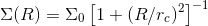

# StarClusterMixtureModel
Mixture model method for identifying subclusters of young stars in star-forming regions

The code has been published by [Kuhn et al. (2014, ApJ, 787, 107)](https://doi.org/10.1088/0004-637X/787/2/107), which includes a vignette that provides a walk-through of how to run the code on real data. The method has also been used in several other astronomical studies including [this one](https://doi.org/10.3847/1538-3881/aa9177) and [this one](https://doi.org/10.1093/mnras/sty473). This code is also discussed in Chapter 19 "Applications in Astronomy" by Kuhn and Feigelson in the [Handbook of Mixture Analysis](https://www.crcpress.com/Handbook-of-Mixture-Analysis/Fruhwirth-Schnatter-Celeux-Robert/p/book/9781498763813), edited by Fruhwirth-Schnatter, Celeux, and Robert.

# Motivation
There are several challenges when using mixture models to model star clusters. One of these is that the spatial distribution of stars in a cluster does not follow a normal density distribution, but instead follows a distribution with significantly heavier tails. The surface density of stars as a function of projected radius R in a typical young open cluster is described more closely by an equation of the form . The second challenge is that astronomical datasets are often constrained to a field of view, so the boundaries of the region must be taken into account. This has a particularly large impact on studies of young stellar clusters because stars are widely dispersed over a large region, so the peripheral regions of the cluster are likely to be truncated.

# Vignette
```R
library(plotrix)
library(spatstat)
source("StarClusterMixtureModel.R")

clust <- star.ppp(target = "ngc6357",
   distance = 1.7)
clust <- unique(clust)
```

```R
k <- 6

param2 <-c(k+1, ell.model, 5, ell.model, 5,
   ell.model, 5,
   ell.model, 5, ell.model, 5, ell.model, 5,
   const.model, 0)

param.init <-c(
   -1.00, -3.25, 0.3, 0, 1,
    3.75,  1.25, 0.3, 0, 1, -0.4533811,
   -2.50, -4.50, 0.3, 0, 1, -0.7415462,
   -1.25, -2.50, 0.3, 0, 1,  0.8510107,
   -4.00,  0.75, 0.3, 0, 1,  0.1332489,
    4.00,  4.00, 0.3, 0, 1,  0.1667037,
   -2.0)
   
param2ellipse(param.init)
```

```R
param <- mask.freeze(param,
  mask.adjust_positions(k),
  clust=clust);

param <- mask.freeze(param,
  mask.adjust_size(k),
  clust=clust);

param <- mask.freeze(param,
  mask.adjust_rotations(k),
  clust=clust);

param <- mask.freeze(param,
  mask.adjust_shape(k),
  clust=clust);

param <- mask.freeze(param,
  mask.adjust_positions(k),
  clust=clust);

ocf <- optim(param, model.lik, 
  model=multi.model,
  clust=clust, param2=param2, hessian=TRUE)
param <- ocf$par

L <- -model.lik(param, model=multi.model, 
   clust=clust, param2=param2)
L

AIC <- -2*L + length(param)*2.0
AIC
```

```R
density <- adaptive.density(clust, f=0.1, nrep=10)

make.fig2(param, param2, clust=clust, 
   image=density, min.im=5.0, max.im=20000.0);

make.fig4(param, model=multi.model, clust=clust,
   param2=param2, bandwidth=0.38);
```


